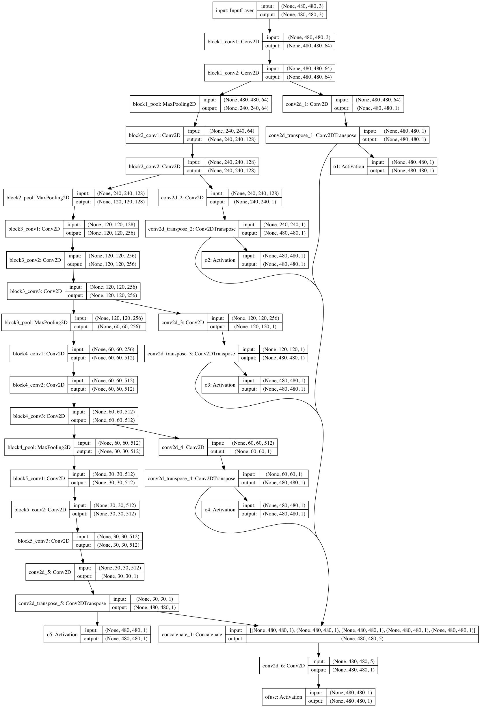
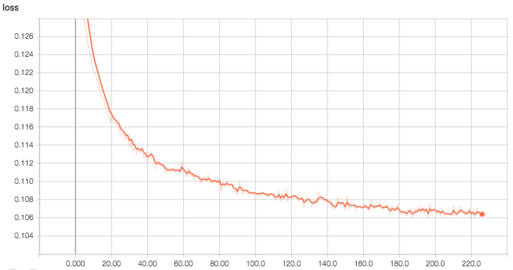
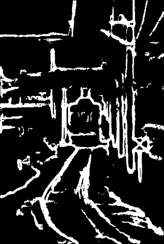
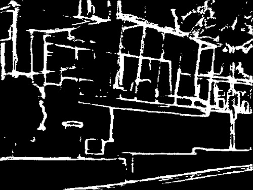
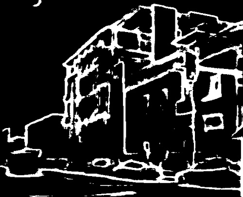
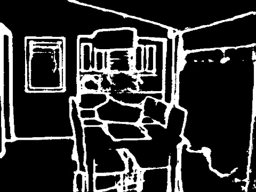
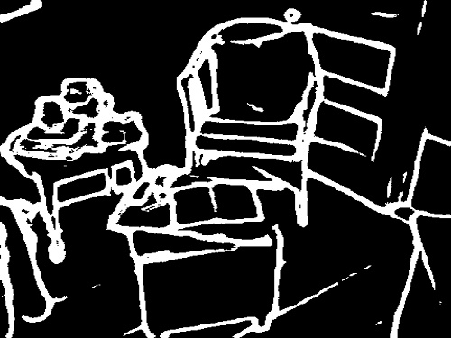

# Keras_HED_with_Model

## 参考

论文：[holistically-nested edge detection](https://arxiv.org/pdf/1504.06375.pdf)
源码：https://github.com/lc82111/Keras_HED

网络结构图

## 训练

1. 下载训练数据：http://vcl.ucsd.edu/hed/HED-BSDS.tar 并解压到工程根目录下
2. 下载预训练模型：https://github.com/fchollet/deep-learning-models/releases 中搜索文件’vgg16_weights_tf_dim_ordering_tf_kernels_notop.h5‘，下载并拷贝到./models目录下
3. 执行 `python main_segmentation.py`进行训练

loss 收敛曲线图:

## 测试

1. 下载模型文件：链接: https://pan.baidu.com/s/17VjM8xghFHQbSAlymfsf0w 密码: rcxi
2. 将文件拷贝到 ./checkpoints/HEDSeg/目录下
3. 修改test.py中的模型文件目录
4. 执行`python test.py`

## 结果

 
 
 
 
 
 

